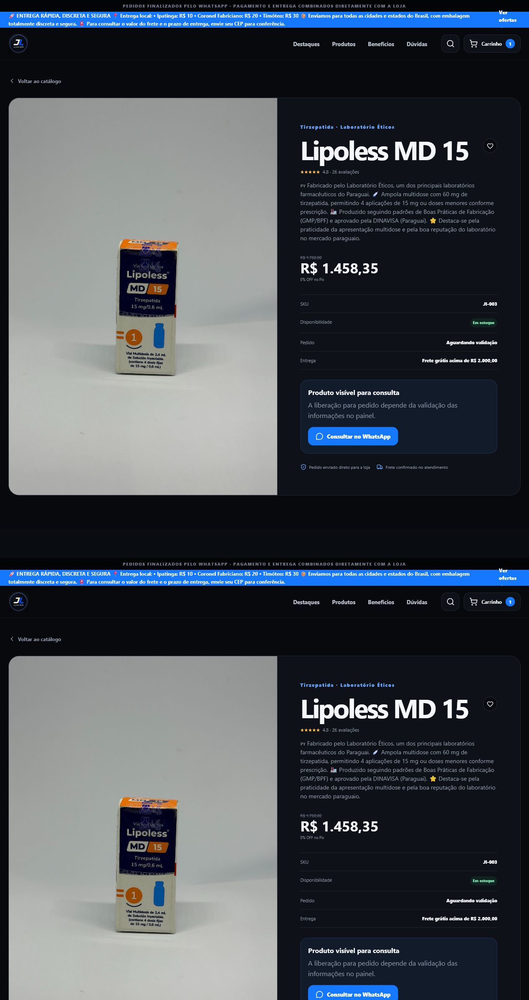
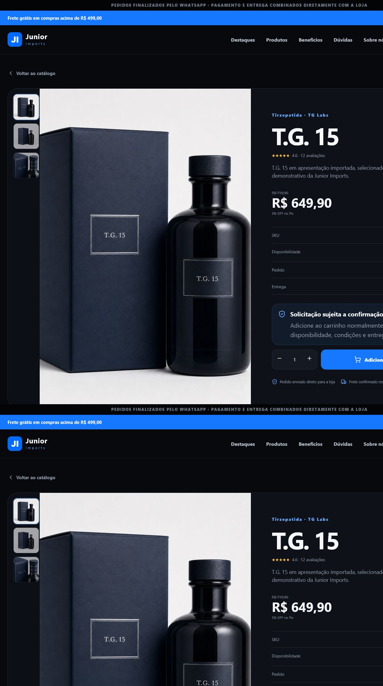
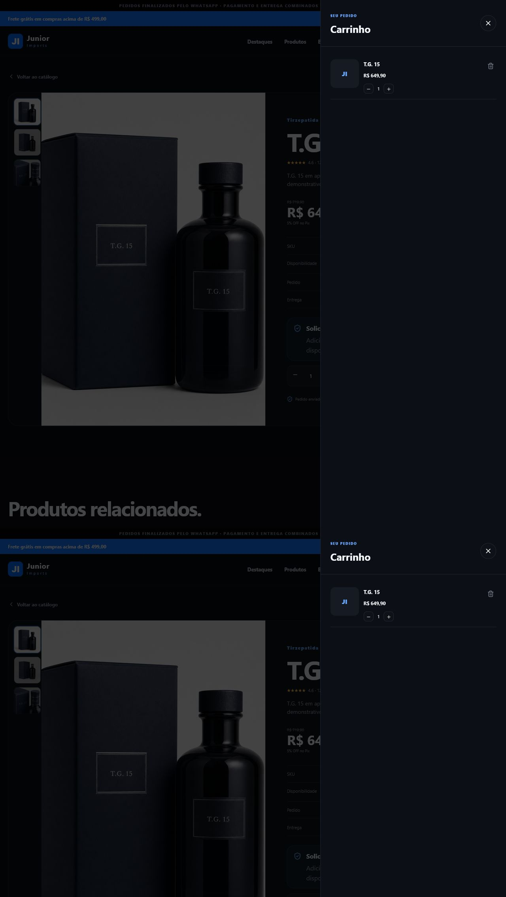

# Auditoria e correção — detalhes do produto para o carrinho

**Data:** 15 de julho de 2026
**Fluxo:** catálogo → mais detalhes → adicionar ao carrinho → confirmação pelo WhatsApp

## Diagnóstico

O botão não estava oculto por CSS. A regra `isProductPubliclySellable` tratava todo produto com validação pendente como item apenas consultivo. Como os produtos reais do catálogo estão marcados como `pending`, a página substituía o CTA de compra por “Consultar no WhatsApp” e o provedor do carrinho também rejeitava a inclusão.

## Correção aplicada

- foi mantida a validação regulatória e criado um critério separado para inclusão no carrinho;
- no modo de checkout pelo WhatsApp, produto ativo, com estoque e não bloqueado pode ser organizado no carrinho;
- produtos sem liberação completa exibem “Solicitação sujeita a confirmação”;
- produtos bloqueados ou sem estoque continuam fora do carrinho;
- o botão espera o carrinho terminar a hidratação antes de ficar ativo, evitando perder o primeiro clique;
- cards relacionados passaram a usar a mesma regra;
- no mobile há uma barra de compra rápida fixa, sem remover o CTA principal;
- após a inclusão, o drawer abre e mostra o item, quantidade e valor.

## Avaliação do fluxo

### Pontos positivos

- CTA primário agora é inequívoco e está junto ao seletor de quantidade;
- a linguagem deixa claro que o carrinho envia uma solicitação e que a loja confirma as condições;
- o mesmo comportamento é aplicado na página, nos cards e no estado persistido;
- o fluxo preserva a identidade visual escura e os componentes já usados na loja;
- o atalho mobile reduz a necessidade de rolar novamente até o botão.

### Limites preservados

- o carrinho não libera itens com status regulatório `blocked`;
- estoque zerado continua indisponível;
- o modo demonstrativo continua aceitando somente produtos totalmente liberados;
- esta mudança não substitui revisão jurídica, farmacêutica ou regulatória do catálogo.

## Validação executada

- 7 testes unitários da regra de produto aprovados;
- TypeScript sem erros;
- ESLint dos arquivos alterados sem erros;
- teste de integração desktop aprovado;
- teste de integração mobile aprovado;
- inspeção real no navegador: botão visível, drawer aberto e produto presente no carrinho.
