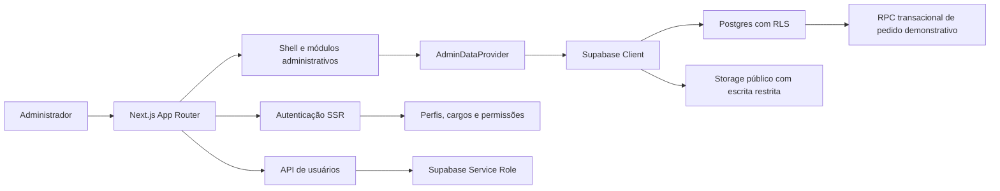
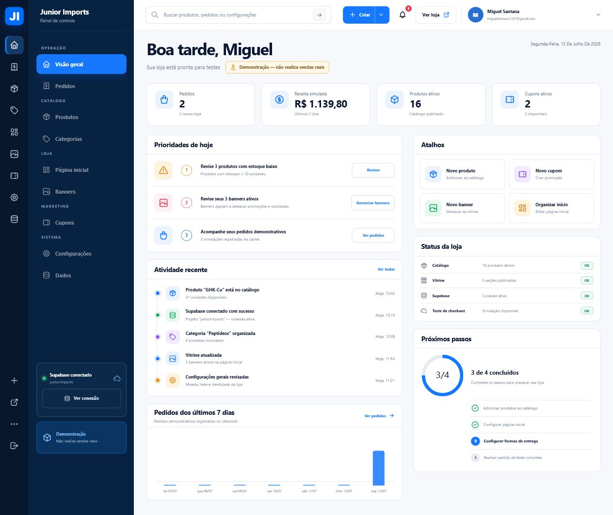
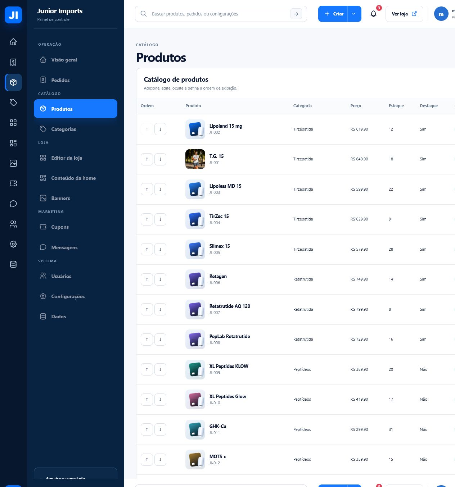
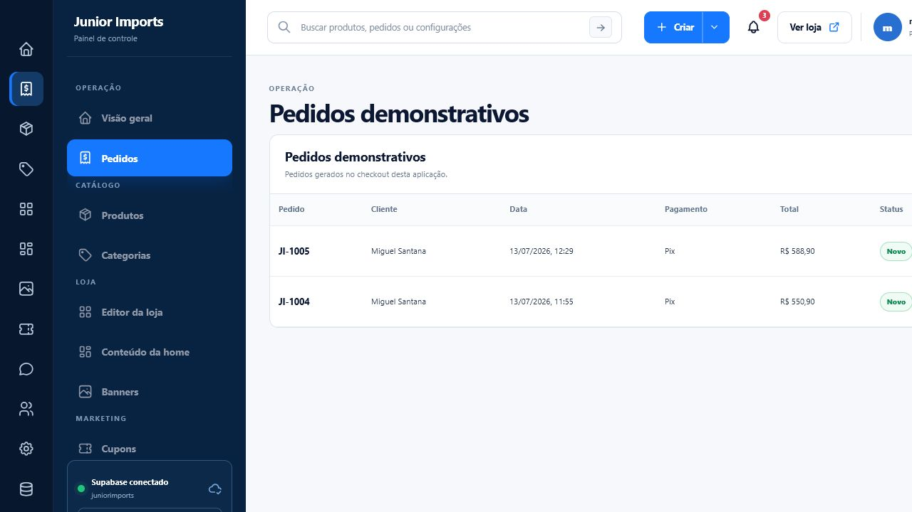
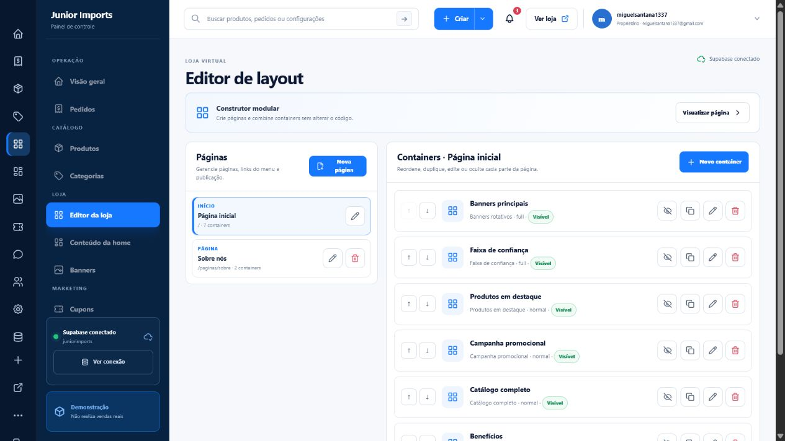
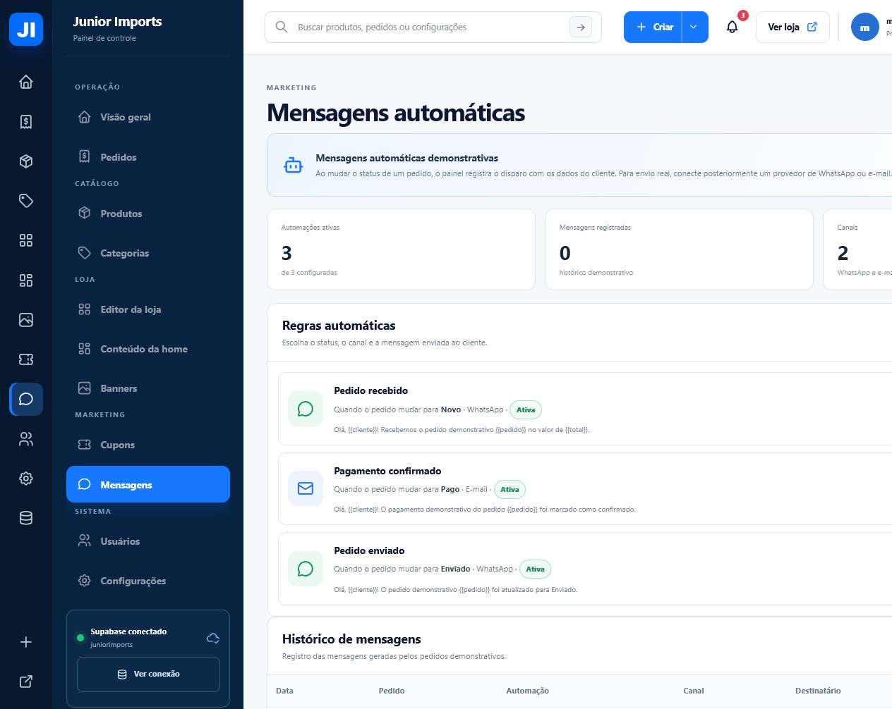
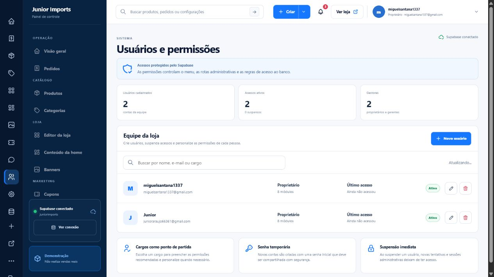
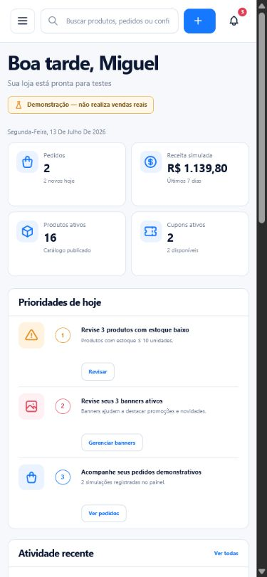
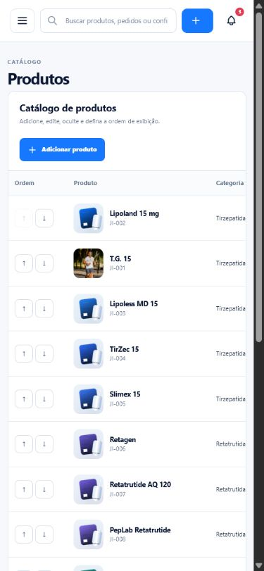
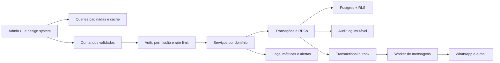

# Relatório completo do sistema de administração — Junior Imports

**Data da auditoria:** 13 de julho de 2026 
**Diretriz atualizada:** 14 de julho de 2026 
**Ambiente revisado:** produção na Vercel e código local 
**Escopo:** experiência administrativa, catálogo privado, frontend, backend, Supabase, segurança, dados, responsividade, acessibilidade, testes e operação 
**Objetivo:** transformar o painel atual em uma experiência fluida, fácil de aprender, segura e preparada para crescer, sem perder a identidade visual da Junior Imports.

> O sistema continua sendo exclusivamente demonstrativo e não realiza vendas, cobranças ou entregas reais.

## 1. Resumo executivo

O painel já tem uma fundação acima da média para um protótipo: identidade consistente, navegação por módulos, dashboard, catálogo, pedidos, editor de páginas, banners, cupons, automações simuladas, usuários e permissões. A conexão com Supabase também parte de decisões corretas, como autenticação verificada no servidor, políticas RLS e chave de serviço restrita ao backend.

O principal limite atual não é a falta de funcionalidades. É a falta de garantias operacionais em torno das funcionalidades existentes. Em várias ações, a interface altera o estado antes de o banco confirmar a gravação; não existe rollback visual se a persistência falhar; erros de leitura podem ser substituídos silenciosamente por dados demonstrativos; reordenações fazem várias gravações sem transação; e não existe histórico real de quem alterou cada registro.

Na experiência, o painel é fácil de reconhecer, mas ainda exige esforço desnecessário em tarefas repetitivas. Tabelas não têm busca, filtros, seleção em massa ou paginação; muitos textos usam 8 a 10 px; a versão móvel transforma tabelas em áreas horizontais extensas; e os formulários mostram apenas o primeiro erro, sem resumo, proteção contra perda de alterações ou feedback detalhado de salvamento.

**Conclusão:** o painel está em aproximadamente **3,0 de 5** como sistema administrativo. É forte como demonstração funcional, mas ainda não deve ser tratado como operação de produção sem uma etapa de robustez, segurança operacional e refinamento de UX.

### Diretriz de distribuição: catálogo privado por link

A Junior Imports não usará a loja como canal público de aquisição. O catálogo será distribuído por indicação, WhatsApp, Instagram, domínio próprio ou link direto. Por isso, deixam de integrar o backlog prioritário:

- produção de conteúdo para mecanismos de busca;
- páginas locais;
- Search Console;
- pesquisa e acompanhamento de palavras-chave;
- otimização para posicionamento no Google;
- estratégia de tráfego orgânico.

A camada técnica de indexação deve permanecer bloqueada em três níveis: metadados globais com `index: false` e `follow: false`, regra geral `Disallow: /` no `robots.txt` e cabeçalho HTTP `X-Robots-Tag: noindex, nofollow`. O `robots.txt` mantém exceções explícitas apenas para `WhatsApp`, `facebookexternalhit` e `Facebot`, que precisam ler os metadados para montar a prévia social e não são usados para posicionamento em buscadores. Esse conjunto reduz a descoberta por busca, mas não cria sigilo: qualquer pessoa com o endereço ainda poderá acessar a vitrine. Se a operação passar a exigir acesso realmente restrito, será necessário acrescentar autenticação, lista de convidados ou links temporários.

Título, descrição e imagem de compartilhamento continuam essenciais. Eles formam a prévia mostrada no WhatsApp, Instagram e outros mensageiros, inclusive nas páginas individuais de produto. A URL da Vercel atende à validação temporária, mas um domínio próprio transmite mais confiança quando o link é enviado a clientes.

As prioridades de produto passam a ser, nesta ordem:

1. experiência mobile-first para acessos vindos de WhatsApp e Instagram;
2. carregamento rápido, com imagens responsivas e mídia otimizada;
3. fotos reais, informações claras e catálogo fácil de explorar;
4. sinais de confiança, contato, política e aviso demonstrativo;
5. carrinho curto, previsível e fácil de revisar;
6. cadastro mínimo e rápido do cliente;
7. cupom visível e aplicável antes da finalização;
8. pedido registrado e mensagem do WhatsApp montada corretamente;
9. painel administrativo personalizável e simples de aprender;
10. autenticação e permissões granulares no painel.

## 2. Escopo e método

A auditoria combinou:

- revisão das rotas, componentes, providers, validações, tipos e estilos;
- revisão das cinco migrações do Supabase, funções, gatilhos, RLS e Storage;
- inspeção visual das principais telas publicadas, em desktop e mobile;
- verificação de tipagem, lint e testes unitários;
- execução parcial da suíte E2E administrativa;
- análise heurística de acessibilidade, legibilidade, áreas de toque e reflow.

Esta não é uma certificação formal de acessibilidade. Testes com teclado completo, leitor de tela, zoom de 200%/400%, contraste automatizado e tecnologias assistivas ainda são necessários.

## 3. Arquitetura atual

### Pontos positivos da arquitetura

- Separação clara entre loja, administração, domínio, providers e integração Supabase.
- Autenticação administrativa validada no servidor antes de renderizar rotas protegidas.
- RLS por módulo e verificação de usuário ativo no banco.
- Chave `service role` usada apenas no servidor para criar e excluir usuários.
- Validação com Zod nas principais entidades.
- RPC de pedido recalcula preços, descontos e disponibilidade no banco.
- Tipos TypeScript centralizados e modo local útil para demonstração.
- Cabeçalhos básicos de segurança já configurados.

### Limites estruturais atuais

- O `AdminDataProvider` concentra quase todas as operações administrativas em um único arquivo e grava diretamente do navegador no Supabase.
- Não existe camada de serviços/casos de uso com transações, idempotência, auditoria e tratamento padronizado de erros.
- A leitura do painel carrega muitas tabelas de uma vez e não pagina produtos, pedidos, usuários ou logs.
- Falhas de consulta podem ser mascaradas por dados-semente, misturando estado real e demonstrativo.
- A permissão é por módulo e concede leitura e escrita juntas; não existe distinção entre visualizar, criar, editar, publicar, excluir e exportar.
- Não há modelo de clientes, variantes, movimentações de estoque, eventos do pedido, notas internas ou histórico de publicação.

## 4. Avaliação de maturidade

| Área | Nota | Diagnóstico |
| --- | ---: | --- |
| Cobertura funcional | 4,2/5 | O painel cobre os principais módulos esperados em uma demonstração de e-commerce. |
| Navegação e compreensão | 3,7/5 | Estrutura familiar e bem agrupada, mas busca, notificações e ajuda ainda são superficiais. |
| Formulários e feedback | 2,8/5 | Validação existe, porém o tratamento visual de erro, espera, sucesso e perda de alterações é limitado. |
| Responsividade | 3,1/5 | Dashboard móvel funciona bem; tabelas dependem de rolagem horizontal e ocultam contexto. |
| Acessibilidade | 2,3/5 | Há semântica e foco visível, mas textos e alvos são pequenos, e os modais precisam de foco gerenciado. |
| Segurança | 3,4/5 | Auth, RLS e separação da chave de serviço são boas; faltam MFA, rate limit, auditoria e políticas mais granulares. |
| Integridade de dados | 2,7/5 | Existem constraints e RPC, mas operações administrativas não são transacionais e não têm rollback. |
| Escalabilidade | 2,2/5 | Listas completas no cliente e provider centralizado não escalam bem. |
| Observabilidade e operação | 1,8/5 | Não há trilha de auditoria, monitoramento, alertas, métricas técnicas ou restauração operacional no painel. |
| Testes | 3,8/5 | Tipagem, lint, build, unitários e os fluxos E2E atuais passam em desktop e mobile; ainda faltam integração de RLS, acessibilidade e regressão visual. |

## 5. Auditoria dos fluxos principais

### 5.1 Visão geral — estado saudável com ressalvas

**O que funciona bem**

- Hierarquia visual clara entre resumo, prioridades, atividade e próximos passos.
- Aviso demonstrativo visível sem interromper a operação.
- Atalhos reduzem a distância até as ações mais comuns.
- Cards se reorganizam corretamente no mobile.

**Riscos e melhorias**

- Parte da atividade recente e das notificações é fixa no código, podendo comunicar algo que não aconteceu.
- “Receita dos últimos 7 dias” soma todos os pedidos carregados, não necessariamente apenas sete dias.
- Faltam comparação com período anterior, filtros por data, atualização e origem dos dados.
- O dashboard deve permitir clicar em cada indicador e abrir a lista já filtrada.
- Cards configuráveis por cargo evitariam excesso de informação para suporte ou editor.

### 5.2 Produtos — utilizável, porém denso

**O que funciona bem**

- Produtos, categoria, preço, estoque, destaque e status aparecem na mesma visão.
- Reordenação, ocultação, edição e exclusão estão disponíveis.
- Imagem e SKU ajudam a reconhecer o item.

**Riscos e melhorias**

- Não há busca, filtros, ordenação por coluna, paginação, seleção em massa ou views salvas.
- Reordenar item por item com setas é lento em catálogos grandes.
- Ações críticas usam ícones e `window.confirm`, sem explicar impacto ou oferecer desfazer.
- No mobile, o contêiner da tabela tem aproximadamente 352 px de largura e 820 px de conteúdo; isso obriga rolagem horizontal e esconde preço, estoque, status e ações.
- Recomenda-se uma visão em cards no mobile, com nome, estoque, status e menu de ações sempre visíveis.

### 5.3 Pedidos — bom ponto de partida, operação ainda rasa

**O que funciona bem**

- Lista simples e legível com cliente, data, pagamento, total e status.
- Modal reúne cliente, itens, valores e mudança de status.
- A mudança de status pode registrar uma automação demonstrativa.

**Riscos e melhorias**

- Faltam busca por pedido/cliente, filtros de período/status/pagamento e paginação.
- O pedido não possui timeline de eventos, autor das alterações, comentários, tags ou motivo de cancelamento.
- Status e log de mensagem não são gravados em uma única transação; uma etapa pode funcionar e a outra falhar.
- Não existe visão de clientes, histórico por cliente, pedidos abandonados ou segmentação.
- Deve haver idempotência para evitar repetição de ações e mensagens.

### 5.4 Editor da loja — fundação forte, falta segurança editorial

**O que funciona bem**

- Páginas e containers são conceitos claros e permitem personalização sem código.
- Há duplicação, ocultação, edição e ordenação.
- A página inicial é protegida contra exclusão direta.

**Riscos e melhorias**

- Falta preview ao vivo lado a lado e alternância desktop/tablet/mobile.
- Não há rascunho, agendamento, versão publicada, histórico, undo/redo ou restauração.
- Setas devem ser complementadas por drag-and-drop acessível e opção de digitar posição.
- Containers precisam de biblioteca, miniatura, duplicação entre páginas e presets reutilizáveis.
- Publicação deve ser uma ação explícita e separada de salvar rascunho.

### 5.5 Mensagens — clara como demonstração, incompleta para envio real

**O que funciona bem**

- O painel deixa claro que os disparos são demonstrativos.
- Gatilho, canal, status e mensagem podem ser entendidos rapidamente.
- O histórico cria uma base útil para rastreabilidade.

**Riscos e melhorias**

- Não existe provedor real, fila, retry, backoff, dead-letter queue ou webhook de entrega.
- Não há consentimento, opt-out, horário silencioso, limite de frequência ou versão do template.
- O usuário precisa visualizar o resultado com dados de exemplo antes de ativar a automação.
- Um envio de teste deve exigir confirmação explícita do destinatário e deixar claro que transmitirá dados.

### 5.6 Usuários e permissões — boa base de segurança

**O que funciona bem**

- Usuários reais são criados no Supabase Auth.
- Há cargos, permissões personalizadas, suspensão e proteção do último proprietário.
- Rotas, menu e RLS respeitam permissões.

**Riscos e melhorias**

- O fluxo cria conta com senha temporária e e-mail já confirmado; o ideal é convite com link único e definição de senha pelo próprio usuário.
- Faltam MFA, recuperação de senha, revogação de sessões, dispositivos ativos e política de senha.
- As permissões são amplas por módulo. Devem evoluir para ações: visualizar, criar, editar, publicar, excluir, exportar e gerenciar.
- A lista busca até 1.000 usuários em uma chamada; precisa de paginação e busca no servidor.
- Toda criação, alteração, suspensão e exclusão deve gerar evento de auditoria imutável.

### 5.7 Experiência móvel — dashboard bom, gestão de lista limitada

O dashboard preserva hierarquia e prioridade no celular. Já o catálogo mantém o formato de tabela desktop e exige rolagem horizontal. A solução ideal é responsividade por tarefa, não apenas por largura: dashboard em cards, listas operacionais em cards compactos, formulários em etapas e ações principais fixas no rodapé.

## 6. Evidências de acessibilidade e legibilidade

Na tela de produtos publicada, uma inspeção heurística encontrou:

- 115 elementos interativos visíveis; todos tinham pelo menos uma dimensão inferior a 44 px;
- 295 de 313 elementos de texto amostrados com fonte inferior a 12 px;
- foco visível global e boa estrutura de headings;
- nomes acessíveis na maioria dos botões de ação da tabela;
- um campo oculto interno do framework detectado sem rótulo, sem impacto direto para o usuário.

Esses números não significam, sozinhos, falha formal de WCAG, pois existem exceções para tamanho de alvo. Eles demonstram, porém, uma densidade alta que prejudica leitura, precisão de clique e conforto, principalmente em telas menores ou com zoom.

### Melhorias recomendadas

- Texto operacional: mínimo recomendado de 12–14 px; conteúdo principal: 14–16 px.
- Botões principais e controles de formulário: 40–44 px de altura.
- Ícones isolados: nome acessível, tooltip e área clicável ampliada.
- Modais: foco inicial, armadilha de foco, fechamento por Escape, retorno ao elemento de origem e bloqueio de scroll do fundo.
- Erros: mensagem junto ao campo, resumo no topo e foco no primeiro erro.
- Tabelas: cabeçalhos persistentes, descrição, navegação por teclado e alternativa em cards.
- Testes com teclado, NVDA, zoom e contraste antes de declarar conformidade.

## 7. Melhorias de frontend

### 7.1 Navegação e orientação

- Transformar a busca global em command palette com resultados reais, atalhos e ações.
- Incluir breadcrumbs nas telas profundas e preservar filtros ao voltar.
- Criar central de ajuda contextual, tour inicial e checklist por cargo.
- Tornar notificações reais, com lida/não lida, prioridade, data, destino e preferências.
- Adicionar menu de perfil com segurança, sessões, preferências e sair.

### 7.2 Listas e produtividade

- Busca e filtros server-side com URL compartilhável.
- Paginação, ordenação por coluna e contagem total.
- Seleção em massa, ações em lote e confirmação com resumo do impacto.
- Views salvas por usuário e escolha de colunas.
- Sticky header, densidade confortável/compacta e exportação controlada.
- Drag-and-drop acessível para ordenação, com fallback por teclado e posição numérica.

### 7.3 Formulários

- Padronizar todos os formulários com React Hook Form + Zod.
- Mostrar erros por campo, não apenas o primeiro erro geral.
- Indicar campo obrigatório, formato esperado e contador de caracteres.
- Salvar rascunho, detectar alterações não salvas e pedir confirmação ao sair.
- Desabilitar submit durante gravação e mostrar estados “Salvando”, “Salvo” e “Falhou”.
- Manter o modal aberto quando a gravação falhar.
- Incluir preview, crop, texto alternativo, dimensões e peso no upload de mídia.

### 7.4 Feedback e prevenção de erro

- Substituir `window.confirm` por modal consistente, com nome do item e consequência.
- Preferir soft delete e opção “Desfazer” em exclusões recuperáveis.
- Implementar rollback de atualizações otimistas.
- Estados padronizados: skeleton, vazio, erro, sem permissão, offline e retry.
- Toasts com tipo, duração adequada, ação e anúncio acessível.

### 7.5 Design system

- Extrair tokens de cor, tipografia, espaçamento, raio, sombra e densidade.
- Criar componentes comuns para DataTable, Modal, Drawer, FormField, EmptyState, ErrorState, ConfirmDialog e PageHeader.
- Documentar estados no Storybook ou catálogo visual equivalente.
- Adicionar regressão visual para desktop e mobile.

## 8. Melhorias de backend e dados

### 8.1 Camada de aplicação

- Mover mutações críticas para Server Actions ou Route Handlers com autenticação, autorização e validação server-side.
- Separar módulos de catálogo, conteúdo, pedidos, mensagens, identidade e usuários.
- Padronizar retorno de erro com código, mensagem segura e `traceId`.
- Usar transações/RPC para reordenação, mudança de status + evento + automação e exclusões relacionadas.
- Implementar versionamento otimista por `updated_at` para detectar edição concorrente.
- Adicionar chaves de idempotência em criação de pedido e ações repetíveis.

### 8.2 Integridade de dados

- Não substituir erro de produção por dados-semente silenciosamente; mostrar indisponibilidade e permitir retry.
- Criar `order_events`, `inventory_movements`, `customers`, `customer_addresses`, `product_variants` e `media_assets` quando esses domínios forem necessários.
- Normalizar campos críticos de cliente ou validar rigidamente o JSON no banco.
- Adicionar constraints para percentuais de cupom, quantidade máxima, ordem não negativa e formatos essenciais.
- Não expor cupons ativos completos ao público; validar o código no servidor e retornar apenas o resultado.
- Introduzir soft delete (`deleted_at`) e política de retenção.

### 8.3 Segurança

- Adicionar rate limiting por IP, usuário e rota nas APIs e RPCs públicas.
- Validar `Origin`/CSRF em mutações autenticadas quando aplicável.
- Implementar MFA para proprietários e gerentes.
- Trocar senha temporária por convite seguro e expiração do link.
- Revogar sessões ao suspender usuário e permitir encerramento de dispositivos.
- Refinar permissões para ação e recurso, mantendo enforcement no banco.
- Adicionar CSP e HSTS depois de validar todos os recursos externos.
- Fixar versões das dependências em vez de depender de `latest` no manifesto.
- Fazer rotação periódica da chave de serviço e registrar todo uso privilegiado.

### 8.4 Storage e mídia

- Validar MIME, extensão, tamanho e dimensões no servidor.
- Definir quotas por arquivo e por loja.
- Gerar nomes controlados, metadados, variantes responsivas e thumbnails.
- Remover arquivos órfãos após substituir ou excluir entidades.
- Avaliar buckets privados com URLs assinadas para conteúdo que não precise ser público.

### 8.5 Mensageria

- Criar tabela outbox e worker assíncrono.
- Adaptadores independentes para WhatsApp e e-mail.
- Retry exponencial, limite de tentativas, fila de falhas e reprocessamento manual.
- Webhooks assinados para entregue, lido, falhou e opt-out.
- Versionar templates e guardar o conteúdo efetivamente enviado.

### 8.6 Observabilidade e continuidade

- Logs estruturados com usuário, ação, recurso, duração, resultado e `traceId`.
- Tabela imutável de auditoria com antes/depois para mutações administrativas.
- Monitoramento de erros frontend/backend, latência, taxa de falha e filas.
- Alertas para falha de login, erro de gravação, fila parada e uso anormal da chave privilegiada.
- Política de backup com RPO/RTO definidos e teste periódico de restauração.
- Página de saúde interna com Supabase, Storage, filas e versão implantada.

## 9. Arquitetura recomendada

Princípio central: a interface pode ser otimista, mas o backend deve ser a autoridade. Toda ação precisa ter confirmação, rollback, trilha de auditoria e um resultado compreensível para o usuário.

## 10. Melhorias por módulo

| Módulo | Próxima evolução recomendada |
| --- | --- |
| Dashboard | Dados reais, filtros de período, comparação, drill-down, widgets por cargo e atividade gerada por audit log. |
| Produtos | Busca, filtros, paginação, ações em massa, variantes, fotos reais, mídia otimizada, estoque e publicação agendada. |
| Categorias | Árvore hierárquica, drag-and-drop, imagem, regras de visibilidade e contagem por status. |
| Editor da loja | Preview ao vivo, rascunho/publicação, histórico, undo/redo, presets e visualização por breakpoint. |
| Banners | Agendamento, audiência, preview, texto alternativo, métricas e validação de proporção. |
| Cupons | Limite de uso, usos por cliente, produtos/categorias elegíveis, combinação, relatório e validação privada. |
| Pedidos | Busca/filtros, timeline, comentários, tags, eventos, cliente, idempotência e ações em lote. |
| Mensagens | Outbox, provedores, testes, consentimento, versionamento, retry e status de entrega. |
| Usuários | Convites, MFA, sessões, permissões granulares, grupos e auditoria. |
| Configurações | Seções menores, preview, histórico, validação de domínio e separação entre marca, operação e integrações. |
| Dados | Exportações assíncronas, backup remoto, restauração controlada, auditoria e política de retenção. |

## 11. Backlog priorizado

### P0 — estabilização imediata

1. Bloquear indexação por metadados, cabeçalho HTTP e `robots.txt`, sem remover a prévia social.
2. Validar a vitrine em celulares reais e otimizar imagens, fontes e JavaScript do caminho crítico.
3. Garantir o fluxo completo catálogo → carrinho → cupom → cadastro mínimo → registro → WhatsApp.
4. Substituir imagens genéricas por fotos reais, com proporção, compressão e fallback padronizados.
5. Proteger todo o painel com autenticação server-side e permissões por ação.
6. Tornar a suíte E2E determinística e cobrir o fluxo de indicação até o WhatsApp.
7. Implementar tratamento de erro e rollback nas mutações administrativas.
8. Remover fallback silencioso para dados-semente quando o Supabase configurado falhar.
9. Padronizar estados de carregamento, falha e nova tentativa nas rotas do painel.

### P1 — segurança e fluidez operacional

1. Audit log real e atividade do dashboard derivada dele.
2. Busca, filtros, paginação e ações em massa em produtos, pedidos e usuários.
3. Formulários padronizados, erro por campo, proteção contra perda e confirmação de salvamento.
4. Transações para reordenação e status do pedido + eventos + mensagens.
5. Convites, MFA, revogação de sessão e permissões por ação.
6. Aumento de tipografia e áreas de toque; cards operacionais no mobile.
7. Rate limit, origem, idempotência e validação server-side nas rotas críticas.

### P2 — evolução de produto

1. Preview ao vivo, rascunho, publicação, histórico e undo/redo no editor.
2. Clientes, variantes, movimentação de estoque e timeline de pedidos.
3. Pipeline real de mensagens com outbox, worker e provedores.
4. Gestão de mídia com metadados, crop, thumbnails e limpeza de órfãos.
5. Observabilidade completa, alertas e página de saúde.

### P3 — escala e inteligência

1. Dashboard configurável e analytics por canal, produto e campanha.
2. Segmentação de clientes e automações avançadas.
3. Feature flags, experimentos e publicação agendada.
4. Integrações com ERP, frete, pagamentos e canais, mantendo o modo demonstrativo separado.

## 12. Plano sugerido de 90 dias

### Semanas 1–2 — catálogo privado e conversão mobile

- Confirmar bloqueio de indexação e validar a prévia de cada tipo de link.
- Medir a vitrine em rede móvel, reduzir mídia pesada e revisar o caminho crítico.
- Validar carrinho, cupom, cadastro mínimo, registro do pedido e mensagem no WhatsApp.
- Substituir imagens de demonstração por fotos reais aprovadas.
- Configurar domínio próprio quando a identidade comercial estiver definida.

### Semanas 3–4 — produtividade

- DataTable reutilizável com busca, filtros, paginação, seleção e URL state.
- Aplicar primeiro em produtos, pedidos e usuários.
- Revisar tipografia, alvos e cards mobile.

### Semanas 5–6 — segurança

- Audit log, rate limit, validação de origem e eventos de usuário.
- Convite, recuperação, MFA e revogação de sessão.
- Permissões separadas por leitura e gestão.

### Semanas 7–8 — conteúdo

- Rascunho/publicação, preview responsivo e histórico do editor.
- Biblioteca de containers e mídia estruturada.

### Semanas 9–10 — operação

- Timeline do pedido, comentários, tags e transações de status.
- Modelos iniciais de cliente e estoque.

### Semanas 11–12 — automação e observabilidade

- Outbox, worker, retry e provedor de teste.
- Logs, métricas, alertas, backup e teste de restauração.

## 13. Critérios de aceite e métricas

### Experiência

- Pelo menos 90% das tarefas críticas concluídas sem ajuda em teste moderado.
- Catálogo, carrinho e checkout utilizáveis sem zoom ou rolagem horizontal em celulares.
- Prévia de link com título, descrição e imagem corretos na página inicial e no produto.
- Cupom aplicado antes da finalização e refletido no total enviado ao WhatsApp.
- Pedido persistido antes da abertura do WhatsApp, sem duplicação em nova tentativa.
- Redução de 30% no tempo para cadastrar produto e processar pedido.
- Nenhuma perda silenciosa de alterações.
- Erro apresentado junto ao campo e recuperável sem recomeçar o formulário.
- Ação principal acessível em até três interações a partir do dashboard.

### Qualidade técnica

- Typecheck, lint, unitários e E2E verdes no CI.
- Cobertura E2E para login, permissões, produto, página/container, pedido, cupom, mensagem e usuário.
- Testes de integração para cada política RLS e cargo.
- Erro de mutação abaixo de 0,5% e API p95 abaixo de 500 ms nas rotas administrativas usuais.
- 100% das mutações privilegiadas com audit log e `traceId`.
- Zero dependência declarada como `latest` no manifesto.

### Acessibilidade

- Navegação completa por teclado nos fluxos principais.
- Modais com foco gerenciado e retorno correto.
- Zoom de 200% sem perda de ação ou conteúdo.
- Alternativa mobile para tabelas críticas.
- Auditoria automatizada sem violações críticas e revisão manual com leitor de tela.

## 14. Estado dos testes nesta auditoria

- `pnpm typecheck`: aprovado.
- `pnpm lint`: aprovado.
- `pnpm build`: aprovado, incluindo a geração estática de `/robots.txt`.
- Vitest: 9 arquivos e 27 testes aprovados.
- Playwright E2E: 7 cenários executados em desktop e mobile, totalizando 14 de 14 aprovações.
- O fluxo E2E cobre autenticação local, produto, página/container, automação, usuário/permissão, página de produto, carrinho, cupom, pedido no WhatsApp, metadados `noindex`, cabeçalho `X-Robots-Tag`, imagem social e `robots.txt`.

O ambiente E2E isola as variáveis do Supabase e usa dados demonstrativos locais. O próximo avanço é adicionar um pipeline separado contra um projeto Supabase de teste para validar RLS, Storage, convites e operações transacionais sem tocar dados de demonstração ou produção.

## 15. Riscos se novas funcionalidades forem adicionadas agora

- Aumento do provider central e maior dificuldade para tratar erros por módulo.
- Mais estados otimistas sem rollback e maior chance de divergência visual.
- Crescimento das consultas completas e piora de tempo de carregamento.
- Permissões amplas demais para equipes maiores.
- Histórico demonstrativo confundido com evento real.
- Suíte E2E incapaz de detectar regressões antes do deploy.

## 16. Recomendação final

O melhor próximo ciclo é uma **fase de estabilização e fluidez**, não uma expansão de escopo. Ela deve entregar quatro resultados visíveis: operações com confirmação e rollback, listas rápidas com busca/filtro/paginação, formulários que nunca perdem trabalho e testes E2E confiáveis. Em paralelo, o backend deve ganhar audit log, transações e observabilidade. Depois disso, editor avançado, clientes, estoque e mensagens reais poderão crescer sobre uma base muito mais segura.
